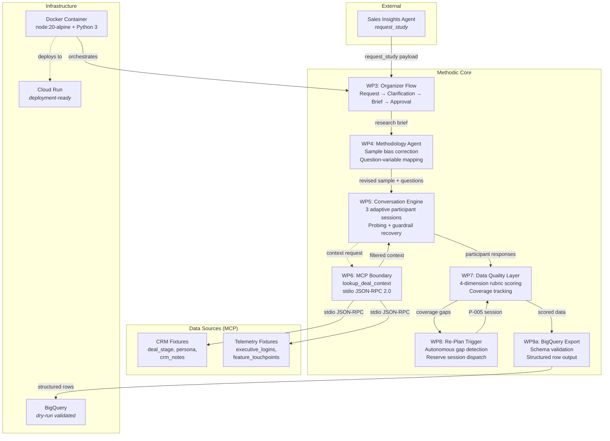
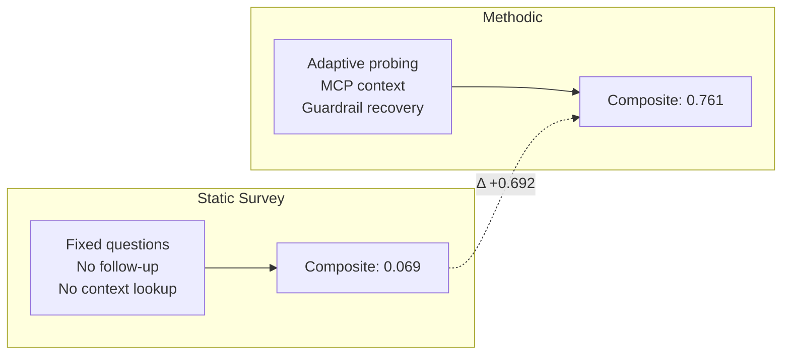
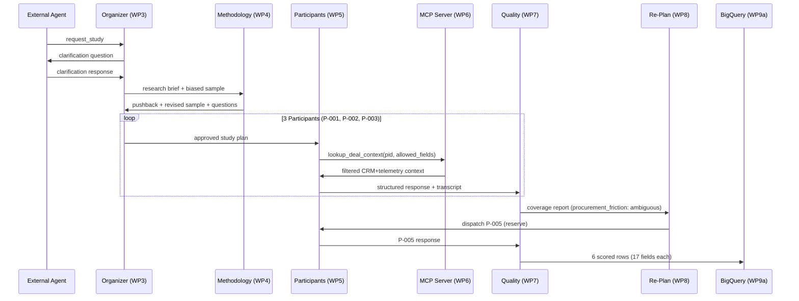
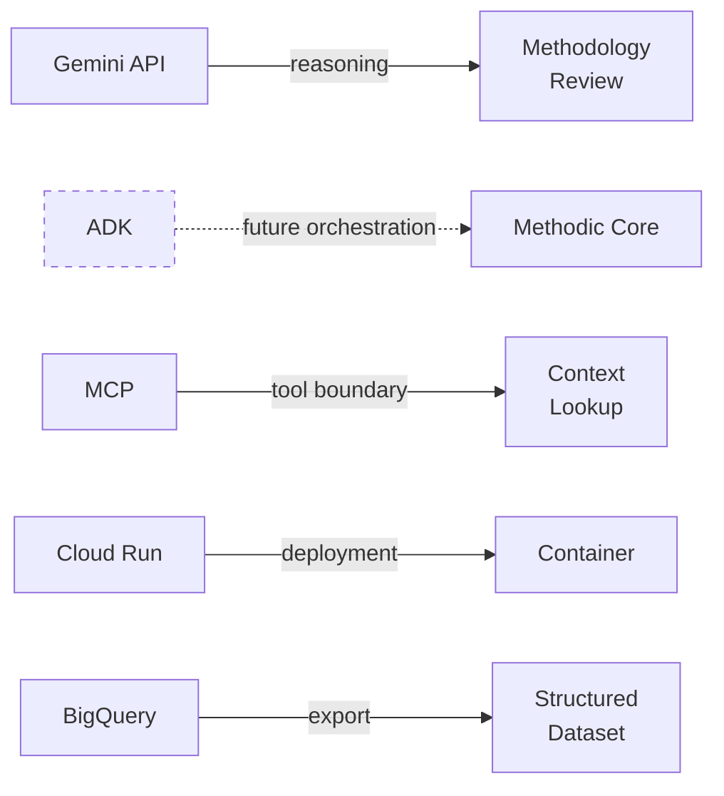

# Architecture Diagram

Mermaid source for the Methodic system architecture. Render with any Mermaid-compatible tool.

## System Flow

## Data Quality Comparison

## Pipeline Sequence

## Google Stack Alignment

